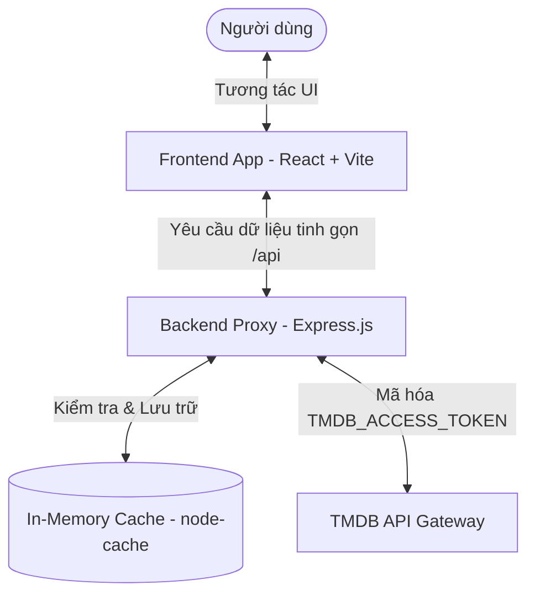

# CineFlow - Nền Tảng Khám Phá & Trải Nghiệm Điện Ảnh Đỉnh Cao 🎬

CineFlow là một ứng dụng web cao cấp dành cho những người yêu thích điện ảnh, cung cấp trải nghiệm duyệt phim, tra cứu thông tin chi tiết và phát trực tuyến các nội dung giới thiệu (trailer) chất lượng cao. Dự án kết nối dữ liệu thời gian thực với API TMDB (The Movie Database) thông qua một tầng máy chủ Proxy bảo mật và tối ưu hiệu năng bằng bộ nhớ cache.

Giao diện của CineFlow được thiết kế theo phong cách **Cinematic Dark Mode** tối giản nhưng đầy sang trọng. Sự kết hợp giữa các hiệu ứng kính mờ (Glassmorphism), dải màu chuyển tiếp tinh tế (Gradients) và các vi hoạt ảnh mượt mà từ Framer Motion mang lại một trải nghiệm thị giác vô song, lôi cuốn người dùng ngay từ cái nhìn đầu tiên.

---

## 🚀 Tính Năng Nổi Bật (Giới thiệu sản phẩm)

CineFlow sở hữu những tính năng vượt trội được thiết kế tối ưu cho trải nghiệm khám phá điện ảnh của người dùng:

*   **Duyệt Phim Điện Ảnh & Truyền Hình**: Khám phá danh sách phim phong phú được cập nhật liên tục theo các danh mục: Xu hướng (Trending), Phổ biến (Popular), Đang chiếu (Now Playing/On the Air), Sắp chiếu (Upcoming), và Đánh giá cao (Top Rated).
*   **Trình Phát Trailer Giả Lập UHD 4K**: Trải nghiệm xem trailer chính thức trực quan và cao cấp thông qua iframe YouTube được thiết kế khung ảnh kính mờ tinh tế, tích hợp sẵn cảnh báo bản quyền chuyên nghiệp và bộ chọn tập phim dài tập tự động.
*   **Trang Khám Phá Chi Tiết**: Cung cấp thông tin đầy đủ về phim bao gồm điểm đánh giá IMDb, thời lượng, thể loại, tóm tắt nội dung cốt truyện, dàn diễn viên chính (Cast Grid) dạng chân dung tròn nghệ thuật, các video liên quan và lưới đề xuất phim tương tự/phim gợi ý.
*   **Tìm Kiếm Đa Mục Tiêu Động**: Bộ tìm kiếm tức thời tích hợp cơ chế trì hoãn (debounce 400ms) và gửi biểu mẫu ngay lập tức, hỗ trợ phân loại bộ lọc (Tất cả, Phim Lẻ, Phim Bộ, Diễn Viên) kèm chỉ số hiển thị số lượng kết quả tìm kiếm thực tế.
*   **Khám Phá Theo Thể Loại**: Hệ thống phân loại thể loại tuyệt đẹp với các biểu tượng đặc thù, hiệu ứng hover phát sáng đặc trưng (Crimson glow cho Movies và Gold glow cho TV Series), cùng bộ lọc sắp xếp nâng cao (Phổ biến nhất, Đánh giá cao, Mới nhất, Cũ nhất).
*   **Tủ Phim Cá Nhân (Watchlist) & Lịch Sử Đã Xem**: Quản lý lưu trữ cục bộ phía Client thông qua `localStorage` với các hook chuyên biệt. Lịch sử xem phim tự động ghi nhận khi truy cập trình phát và giới hạn tối đa 50 phần tử gần nhất.
*   **Trung Tâm Dịch Vụ Khách Hàng**: Các trang hỗ trợ và dịch vụ đầy đủ thông tin (Help Center, FAQ tương tác động, Thiết bị tương thích, Điều khoản dịch vụ, Chính sách bảo mật, Liên hệ hợp tác, Blog phân tích điện ảnh).

---

## 📐 Kiến Trúc Hệ Thống & Luồng Dữ Liệu

CineFlow hoạt động dựa trên mô hình Client - Proxy - API. Dữ liệu từ TMDB không được gọi trực tiếp từ client nhằm đảm bảo bảo mật cho API Token, đồng thời tối ưu hóa tốc độ tải trang bằng cơ chế cache thông minh ở backend proxy.



### Chi tiết luồng dữ liệu & Cơ chế Cache:
1. **Client Yêu cầu**: Frontend gửi yêu cầu lấy dữ liệu tới server proxy (ví dụ: `/api/movies/trending`).
2. **Kiểm tra Cache**: Server proxy tạo khóa cache duy nhất dựa trên URL và tham số query. Nếu tồn tại dữ liệu trong bộ nhớ cache, server sẽ trả về ngay lập tức với cờ `"meta": { "cached": true }`.
3. **Gọi API TMDB**: Nếu cache bị quá hạn (expired) hoặc chưa tồn tại, server proxy sẽ đính kèm khóa bảo mật `TMDB_ACCESS_TOKEN` ở phía máy chủ và gọi tới TMDB API.
4. **Chuẩn hóa & Cache lại**: Dữ liệu thô (raw) từ TMDB được chuẩn hóa cấu trúc, lọc bỏ thông tin thừa và lưu vào bộ nhớ cache (In-memory Cache) với thời gian sống (TTL) linh hoạt, trước khi phản hồi về Client với cờ `"meta": { "cached": false }`.

---

## 🛠️ Công Nghệ Sử Dụng (Tech Stack)

### Frontend (`/app`)
*   **Core Framework**: React 18 & TypeScript (đảm bảo type-safety chặt chẽ)
*   **Build Tool**: Vite (cấu hình tối ưu HMR giúp phát triển nhanh chóng)
*   **Styling**: Tailwind CSS & Custom CSS (xây dựng giao diện Cinematic tối sang trọng)
*   **Animations**: Framer Motion (tạo các hiệu ứng chuyển trang, hover mượt mà)
*   **Icons**: Lucide React (bộ icon hiện đại, đồng bộ)
*   **Định Tuyến**: React Router Dom v6

### Backend (`/server`)
*   **Platform**: Node.js & Express (sử dụng TypeScript)
*   **API Integration**: TMDB Proxy API (ẩn khóa bảo mật, tích hợp cache kết quả tạm thời)
*   **Kiểm duyệt dữ liệu đầu vào**: Zod (validate tham số truy vấn nghiêm ngặt)
*   **Quản lý Cache**: `node-cache` (lưu trữ in-memory cache)
*   **Bảo mật & Logging**: Helmet (bảo mật HTTP headers), CORS (giới hạn nguồn gọi API), Morgan (nhật ký hệ thống)

---

## 📂 Cấu Trúc Thư Mục Dự Án

```text
CineFlow/
├── app/                        # Mã nguồn Frontend (React + Vite + TS)
│   ├── src/
│   │   ├── components/         # Các component chung của ứng dụng
│   │   │   ├── ui/             # Bộ UI Primitives tái sử dụng (Card, Container, Button...)
│   │   │   └── ...             # Các component nghiệp vụ (Hero, MediaCard...)
│   │   ├── config/             # Cấu hình tĩnh (Genre Styles...)
│   │   ├── hooks/              # Custom React Hooks kết nối API TMDB và LocalStorage
│   │   ├── layouts/            # Bố cục giao diện chung (AppLayout, MarketingLayout)
│   │   ├── lib/                # Thư viện tiện ích (cn helper)
│   │   ├── pages/              # Các trang giao diện chính
│   │   │   └── support/        # Các trang tĩnh hỗ trợ dịch vụ
│   │   ├── routes/             # Cấu hình định tuyến (AppRoutes)
│   │   ├── sections/           # Các phần nội dung lớn trên trang chủ
│   │   └── utils/              # Các hàm bổ trợ xử lý dữ liệu và Cache
│   ├── index.html
│   ├── tailwind.config.js
│   └── tsconfig.json
├── server/                     # Mã nguồn Backend Proxy (Express.js + TS)
│   ├── src/
│   │   ├── config/             # Cấu hình biến môi trường và thiết lập TMDB Client
│   │   ├── controllers/        # Điều hướng luồng nghiệp vụ, kiểm duyệt tham số qua Zod
│   │   ├── middlewares/        # Middleware xử lý lỗi toàn cục, 404 Not Found, CORS...
│   │   ├── normalizers/        # Chuẩn hóa dữ liệu thô từ TMDB thành dạng chuẩn CineFlow
│   │   ├── routes/             # Định tuyến các endpoints phân chia theo danh mục
│   │   ├── services/           # Logic nghiệp vụ, gọi dữ liệu từ TMDB, áp dụng Cache
│   │   ├── types/              # Định nghĩa các kiểu dữ liệu TypeScript (raw & normalized)
│   │   ├── utils/              # Helper trợ giúp: tạo cache key, phản hồi API, async handler
│   │   ├── app.ts              # Khởi tạo và liên kết các middleware của ứng dụng Express
│   │   └── server.ts           # Entry point khởi chạy server HTTP tại cổng cấu hình
│   ├── .env.example            # Tệp cấu hình mẫu các biến môi trường
│   ├── package.json            # Danh sách thư viện phụ thuộc và scripts chạy dự án
│   └── tsconfig.json           # Cấu hình biên dịch TypeScript
└── docs/                       # Tài liệu hướng dẫn lập trình & Quy chuẩn coding
```

---

## 🎨 Kiến Trúc UI Primitives (Hệ Thống Thành Phần Dùng Chung)

Để giữ mã nguồn sạch sẽ, tuân thủ nguyên lý Đơn nhiệm (Single Responsibility Principle) và duy trì sự nhất quán về thiết kế tối màu cao cấp, ứng dụng áp dụng bộ UI Primitives dùng chung tại `src/components/ui/`:

1.  **`Container`**: Quản lý độ rộng tối đa và căn lề đệm của nội dung trang đồng bộ.
2.  **`SectionHeader`**: Quản lý phần tiêu đề đoạn, phụ đề và các liên kết/hành động phụ kèm theo.
3.  **`Card`**: Lớp vỏ thẻ dạng kính mờ (Glassmorphic) với 3 biến thể `default`, `glass` và `gradient`.
4.  **`Button`**: Các biến thể nút hành động (`primary`, `secondary`, `outline`, `ghost`, `danger`, `icon`) tích hợp Framer Motion click/hover.
5.  **`Badge`**: Các nhãn đánh dấu phân loại phim, chất lượng phim (HD/4K) và nhãn IMDb.
6.  **Shared States**: Các thành phần hiển thị trạng thái chuẩn hóa: `LoadingState` (quay vòng/khung xương), `ErrorState` (thông báo lỗi và thử lại), `EmptyState` (thông báo không tìm thấy kết quả), `Pagination` (bộ phân trang đồng bộ URL), và `Tabs` (bộ chuyển đổi nội dung linh hoạt).

> [!NOTE]
> Để duy trì tính gọn nhẹ và dễ bảo trì của mã nguồn, tất cả các tệp tin component/trang giao diện đều được kiểm soát nghiêm ngặt và không vượt quá **200 dòng code**. Các logic hoặc component con quá lớn đều được tách biệt rõ ràng.

---

## ⚙️ Thiết Lập Biến Môi Trường (Environment Variables)

Sao chép tệp `.env.example` thành `.env` tại thư mục gốc `/server` và điền đầy đủ các thông tin:

| Tên biến môi trường | Giá trị mặc định | Mô tả chi tiết |
| :--- | :--- | :--- |
| `PORT` | `4000` | Cổng HTTP mà server Express sẽ lắng nghe |
| `NODE_ENV` | `development` | Chế độ chạy ứng dụng (`development` hoặc `production`) |
| `CLIENT_URL` | `http://localhost:5173` | URL Frontend được phép gọi API (dùng cho cấu hình CORS) |
| `TMDB_BASE_URL` | `https://api.themoviedb.org/3` | URL cơ sở để gọi API TMDB phiên bản v3 |
| `TMDB_IMAGE_BASE_URL` | `https://image.tmdb.org/t/p` | URL cơ sở để tạo link ảnh (poster, backdrop, profile) |
| `TMDB_ACCESS_TOKEN` | `your_token_here` | Mã xác thực TMDB Read Access Token (API v4 Auth) |
| `CACHE_TTL_SECONDS` | `21600` | Thời gian sống mặc định của bộ nhớ cache (mặc định 6 tiếng) |

---

## 💻 Hướng Dẫn Cài Đặt & Vận Hành Nhanh

### Yêu Cầu Hệ Thống
*   Đã cài đặt **Node.js** (Phiên bản v18 trở lên được khuyến nghị)
*   Đã cài đặt công cụ quản lý gói **npm** hoặc **yarn**

### 1. Cấu hình & Chạy Backend Server
1.  Di chuyển vào thư mục máy chủ:
    ```bash
    cd server
    ```
2.  Cài đặt các gói phụ thuộc:
    ```bash
    npm install
    ```
3.  Tạo tệp tin `.env` từ tệp tin mẫu `.env.example`:
    ```bash
    cp .env.example .env
    ```
4.  Cấu hình các biến môi trường trong tệp `.env`, đặc biệt là khóa bảo mật TMDB:
    ```env
    PORT=4000
    TMDB_ACCESS_TOKEN=your_tmdb_read_access_token_here
    CLIENT_URL=http://localhost:5173
    ```
    *(Xem chi tiết cách lấy token tại hướng dẫn trong [server/README.md](file:///d:/web/CineFlow/server/README.md))*
5.  Khởi chạy máy chủ ở chế độ phát triển (với cơ chế Hot Reload):
    ```bash
    npm run dev
    ```
    *Máy chủ sẽ chạy tại địa chỉ:* `http://localhost:4000`

### 2. Cấu hình & Chạy Frontend Client
1.  Mở một cửa sổ dòng lệnh mới và di chuyển vào thư mục ứng dụng:
    ```bash
    cd app
    ```
2.  Cài đặt các gói phụ thuộc:
    ```bash
    npm install
    ```
3.  Khởi chạy dev server của Vite:
    ```bash
    npm run dev
    ```
    *Ứng dụng client sẽ khả dụng tại:* `http://localhost:5173`

---

## 📦 Biên Dịch Cho Production

Để đóng gói mã nguồn tối ưu cho môi trường Production:

### Biên dịch Frontend
1.  Di chuyển vào thư mục `/app`:
    ```bash
    cd app
    ```
2.  Chạy lệnh xây dựng dự án:
    ```bash
    npm run build
    ```
    *Thư mục kết xuất `dist/` chứa mã nguồn đã tối ưu và thu nhỏ kích thước sẽ sẵn sàng để triển khai lên các dịch vụ hosting.*

### Biên dịch Backend
1.  Di chuyển vào thư mục `/server`:
    ```bash
    cd server
    ```
2.  Biên dịch mã nguồn TypeScript sang JavaScript:
    ```bash
    npm run build
    ```
3.  Khởi chạy server ở chế độ Production:
    ```bash
    npm run start
    ```

---

## 📚 Danh Sách Endpoints API & Chính Sách Cache

Tất cả các Endpoint API đều trả về định dạng chuẩn:
*   **Thành công**: `{ success: true, message: "...", data: ..., meta: { cached: boolean } }`
*   **Thất bại**: `{ success: false, message: "...", error: { code: "...", details: ... } }`

| Phương thức | Route | Mô tả chức năng | Chính sách Cache (TTL) |
| :--- | :--- | :--- | :--- |
| `GET` | `/api/health` | Kiểm tra trạng thái hoạt động của server | Không cache |
| `GET` | `/api/cache/stats` | Lấy số lượng thống kê cache hiện tại | Không cache |
| `GET` | `/api/movies/trending` | Danh sách phim điện ảnh xu hướng trong ngày | 6 tiếng (`21600`s) |
| `GET` | `/api/movies/popular` | Danh sách phim điện ảnh phổ biến | 12 tiếng (`43200`s) |
| `GET` | `/api/movies/now-playing`| Danh sách phim điện ảnh đang chiếu rạp | 6 tiếng (`21600`s) |
| `GET` | `/api/movies/top-rated` | Danh sách phim điện ảnh điểm cao nhất | 24 tiếng (`86400`s) |
| `GET` | `/api/movies/:id` | Chi tiết thông tin một bộ phim điện ảnh | 24 tiếng (`86400`s) |
| `GET` | `/api/tv/trending` | Danh sách phim truyền hình xu hướng | 6 tiếng (`21600`s) |
| `GET` | `/api/tv/popular` | Danh sách phim truyền hình phổ biến | 12 tiếng (`43200`s) |
| `GET` | `/api/genres/movie` | Danh sách các thể loại phim điện ảnh | 7 ngày (`604800`s) |
| `GET` | `/api/search/multi` | Tìm kiếm đa mục tiêu (Movie, TV, Diễn viên) | 30 phút (`1800`s) |

*(Xem thêm danh sách chi tiết các endpoints khác và hướng dẫn kiểm thử thủ công tại [server/README.md](file:///d:/web/CineFlow/server/README.md))*

---

## 📜 Quy Chuẩn Lập Trình (Coding Standards)

Mọi đóng góp mã nguồn cho dự án bắt buộc phải đọc và tuân thủ tài liệu hướng dẫn quy chuẩn lập trình tại:
👉 **[Frontend Coding Standards](file:///d:/web/CineFlow/docs/frontend-coding-standards.md)**

Các nguyên tắc cốt lõi bao gồm:
*   Giới hạn file tối đa **200 dòng code**.
*   Sử dụng TypeScript nghiêm ngặt, tuyệt đối cấm dùng `any`.
*   Chú thích code giải thích nghiệp vụ bằng **Tiếng Việt**.
*   Không gọi API TMDB trực tiếp từ Client, bắt buộc đi qua `/api` của Backend proxy.
*   Áp dụng triệt để bộ UI Primitives và Shared States thay vì viết mã Tailwind trùng lặp.

---

## 📣 Ghi chú Bản quyền & Attribution

> [!WARNING]
> **TMDB Attribution Note**
> "This product uses the TMDB API but is not endorsed or certified by TMDB."
> *(Sản phẩm này sử dụng dịch vụ API của TMDB nhưng không được chứng thực hoặc xác nhận bởi TMDB).*
